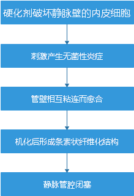

# 下肢静脉曲张的硬化剂治疗

## 硬化治疗的定义

通过静脉内注射液体或泡沫硬化剂从而对区长静脉定位化学消融治疗

## 病生理过程
<center>



</center>

## 硬化剂

### 作用较弱:

铬酸盐甘油:多用于毛细血管扩张和网状浅静脉曲张

### 作用较强:

4% ~8%碘溶液:隐静脉主干、隐-股（腘）段交界处和交通静脉的倒流和曲张

### 较新的硬化剂

聚多卡醇泡沫制剂:注入后可在局部停留较长时间，注射时不与血液立即混合，因而不会很快被血流稀释和冲散，浓度稳定意味着可以对内膜可维持较长时间的作用，同时可以使用低浓度硬化剂。

## 硬化剂治疗禁忌  

### 绝对禁忌  
- 硬化剂过敏
- 急性深静脉血栓和（或）肺栓塞
- 局部注射区域感染或严重全身感染
- 长期卧床
- 症状性右向左分流,如症状性卵圆孔未闭    

### 相对禁忌

- 妊娠期
- 哺乳期
- 严重周围动脉阻塞性疾病
- 一般情况差
- 过敏体制
- 高血栓风险:血栓病史、血栓形成倾向、高凝状态、癌症患者等
- 急性浅静脉血栓
- 之前的泡沫硬化剂治疗后有过诸如偏头痛之类神经症状  


## 并发症  


### 最常见并发症  
- 色素沉着  


### 最严重的并发症
- 过敏  


### 少见罕见并发症
- 过敏
- 组织坏死
- 中风或短暂性脑缺血发作
- 远端及近端深静脉血栓
- 肺栓塞
- 运动神经损伤
- 视力模糊
- 头痛
- 感觉神经损害
- 胸闷
- 干咳
- 浅表静脉炎
- 皮肤坏死  


## 动脉注射
- 怀疑有过敏反应:立即停止注射,并采去急救措施(如注射肾上腺素)
- 导致广泛组织坏死
- 导管溶栓治疗
- 全身抗凝治疗
- 早期口服剂激素类药物  


## 适用的静脉曲张
- 隐静脉功能不全
- 属支静脉曲张
- 网状静脉曲张
- 毛细血管扩张(蜘蛛静脉)
- 术后残余或复发静脉曲张
- 盆腔来源静脉区长
- 腿部溃疡近端的静脉曲张及静脉畸形

## 适应症
- 直径<5mm的静脉曲张:泡沫硬化剂治疗有明显的优势，安全性髙
- 直径5 ~ 10 mm的静脉曲张:考虑使用泡沫硬化剂注射或腔内热损伤治疗
- 直径>10 mm的静脉曲张:推荐行传统开放手术

##  CEAP分级:
```
Specifically, for each clinical condition, it distinguishes:
  ● Primary from secondary and from congenital causes of
the problem
  ● Reflux from obstructive pathophysiology
  ● The precise anatomic segments affected by reflux or
obstruction through 18 named segments of the lower
extremity venous tree
```
- clinical manifestations
- etiologic basis for the
- anatomic distribution
- pathophysiologic mechanism

---
**clinical classification**

| Classification | Description |
|--------|--------|
|       C0 | No visible or palpable signs of venous disease       |
|C1|Telangiectasias or reticular veins[^1]|
|C2|Varicose veins[^2]|
|C3|Edema|
|C4a|Pigmentation[^3] and/or eczema[^4]|
|C4b|Lipodermatosclerosis and/or atrophie blanche|
|C5|Healed venous ulcer|
|C6|Active Venous ulcer|
|S|Symptoms including ache,pain,tightness,skin irritation heaviness,<br>and muscle cramps,as well as other complaints attributable to venous dysfunction|
|A|Asymptomatic|
---
**Etiologic classification**

|Classification|Description|
|--|--|
|Ec|Congenital|
|Ep|Primary|
|Es|Secondary(post-thrombotic)|
|En|No venous etiology identified|

---
**Anatomic classification**

|Classification |Description|
|--|--|
|As|Superficial veins|
|AP|Perforating veins|
|Ad|Deep veins|
|An|No venous location identified|


---
**Pathophysiologic classification**

|Classification|Description|
|-|-|
|Pr|Reflux|
|Po|Obstruction|
|Pr,o|Reflux and obstruction|
|Pn|No venous pathophysiology identifiable|

---


****

[^1]: 毛细血管扩张、网状血管
[^2]: 静脉曲张
[^3]: 色素沉积
[^4]: 湿疹
